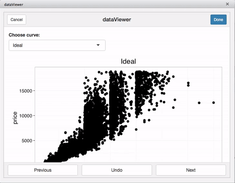

<!-- README.md is generated from README.Rmd. Please edit that file -->
dataViewer
==========

**Daniel Padfield,** <dp323@exeter.ac.uk>

An RStudio Addin for data visualisation, exploratory analysis and identifying outliers.

Issues and suggestions
----------------------

Please report any issues or suggestions in the issues tab [here](https://github.com/padpadpadpad/dataViewer/issues)

Mac : [](https://travis-ci.org/padpadpadpad/dataViewer)

Overview and installation
-------------------------

dataViewer is a package containing an RStudio addin that allows for visualisation of large datasets, exploratory analyses and easier identification of points of interest within the dataset.

``` r
devtools::install_github('padpadpadpad/dataViewer')

library(dataViewer)
```

Quick set up
------------

`dataViewer::dataViewer()` opens up an RStudio addin and allows for interactive point selection. These features could be useful for outlier detection, exploring your dataset or simply identifying points that need further investigation.

So lets see how it works with the `diamonds` dataset from `ggplot2`.

``` r
data("diamonds")

dataViewer(diamonds, x = 'carat', y = 'price', id_col = 'cut')
```

This opens an RStudio addin which plots `price ~ carat` with a different plot for each value of `cut`.

You can click single points and select multiple points using a click and drag box. And after you click DONE, the points you've selected get returned to R!

<p align="center">

</p>
